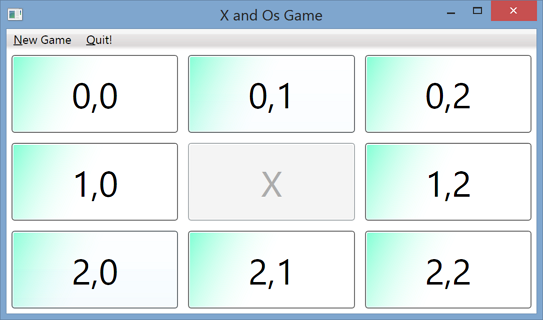

###Write program to play tic-tac-toe, with the following features:

- Menu to permit new game and to quit program; use shortcuts.
- Automatically resize Buttons when screen size is changed by user.
- Display the win announcement as shown.

***

Hints:

1. Divide the **play area** into 9 _separate_ Buttons. You can do this visually by dragging from the Toolbox but it is best to write code to manually create and add the Buttons. This gives you more flexibility when you need a 5×5 grid or to resize them when the user changes Form size.
1. Assign each Button the same single event handler. It’s more efficient to do this manually in your code rather than with the visual designer Property/Event window. If unsure how to do this, look up the designer.cs partial class to see how the code is written – look for the assigning of an event handler and copy this code in your Form class.
1. Once you’ve created an array of Buttons, you need a way to know which Button is in which position. This is needed for later when the user clicks a Button – you’ll need to know it’s at position [0,1] or first row/second column. The Tag property of a control is useful to hold such information.
1. Now you can add the Buttons to the Controls array of the Form so that they appear as child controls of the Form.
1. You will need a separate class to hold the board or grid state. This is best so that the interface choices are separate to the game-play state. Call this class Board. This class maintains the state of each square or cell – x, o, or empty. Use an enumerated data type (e.g. XOStatus) to hold the three possible values.
1. It is possible (and cleaner) for each Button control to hold this information but this ties the game to a particular implementation using Buttons. What if we wanted to develop a version of our game using images instead of Buttons?
1. This Board class also figures out if there is a winner.
1. The Click event must establish where the click occured (i.e. which Button). Remember, you have an array of Button references from Step 2. Also, note that the Click event provides a sender parameter telling you which Button was clicked. 1. From these two pieces of information, you can identify which of your Buttons was clicked.
1. Now update the game status to reflect what has happened the clicked Button. Remember to update the Board object so the change in game state is reflected to that object. Now run a test so see if anyone won, again a task for the Board class.
1. If no winner, toggle the player to let the other player have a go.

